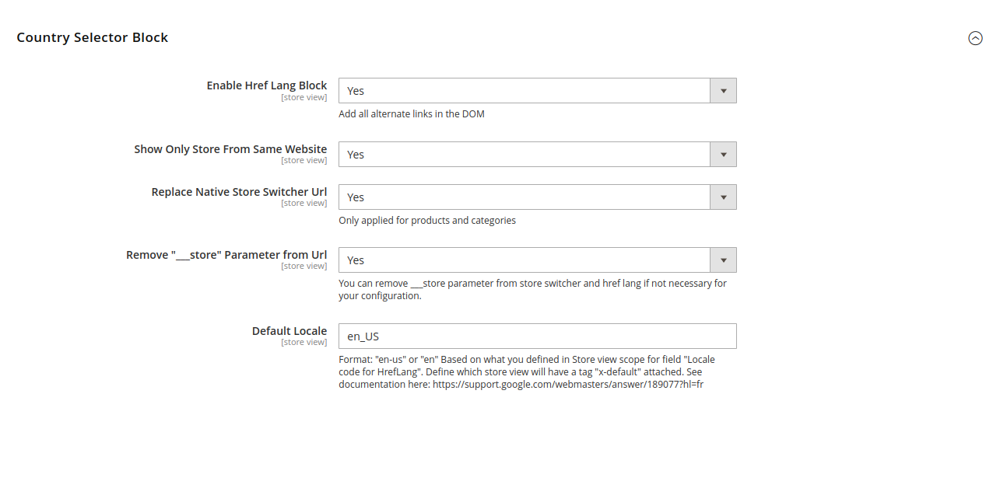
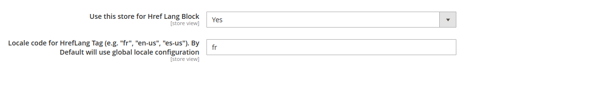

# Installation

- Fill out all configurations within Store -> System Configuration -> Blackbird Extensions -> Href Lang
- Be careful, some config are only available by Store View

### Enable Href Lang Block
Enable block to be injected in layout

### Show Only Store From Same Website

Define if all store views are displayed within hreflang tags or only storeview with same website than current crawled website.

### Replace Native Store Switcher Url

Native Store Switcher block will use URL from hreflang system instead of ugly default Magento URL
Better for SEO. Fallback on default system if no URL are available through Hreflang system

### Remove "___store" Parameter from Url	
In case you have ___store in URL key, remove it

### Default locale

Define which locale is the default one.
Based on what you defined in Store view scope for field "Locale code for HrefLang".
Define which store view will have a tag "x-default" attached.

## Additionnal config by Store view

### Use this store for Href Lang Block
Can exclude targeted store view from hreflang system

### Locale code for HrefLang Tag
(e.g. "fr", "en-us", "es-us"). By Default will use global locale configuration
